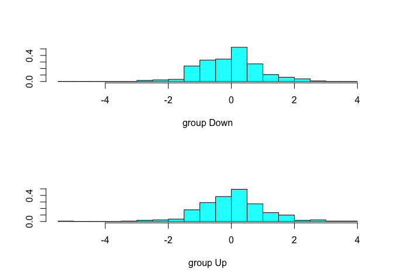

## 1. Ex 10 -- Weekly data


```r
library(ISLR)
library(MASS)
library(class)        

data("Weekly")
train <- Weekly$Year <= 2000

lda.fit <- lda(Direction ~
                 Lag2, data = Weekly, subset = train)
lda.fit
```

```
## Call:
## lda(Direction ~ Lag2, data = Weekly, subset = train)
## 
## Prior probabilities of groups:
##      Down        Up 
## 0.4295775 0.5704225 
## 
## Group means:
##           Lag2
## Down 0.1697418
## Up   0.3381049
## 
## Coefficients of linear discriminants:
##            LD1
## Lag2 0.4967598
```

```r
plot(lda.fit)
```

<!-- -->

```r
lda.pred <- predict(lda.fit, newdata = Weekly[!train,])$class
table(lda.pred, Weekly[!train,]$Direction)
```

```
##         
## lda.pred Down  Up
##     Down    4   6
##     Up    236 275
```

```r
qda.fit <- qda(Direction ~
                 Lag2, data = Weekly, subset = train)
qda.fit
```

```
## Call:
## qda(Direction ~ Lag2, data = Weekly, subset = train)
## 
## Prior probabilities of groups:
##      Down        Up 
## 0.4295775 0.5704225 
## 
## Group means:
##           Lag2
## Down 0.1697418
## Up   0.3381049
```

```r
qda.pred <- predict(qda.fit, newdata = Weekly[!train,])$class
table(qda.pred, Weekly[!train,]$Direction)
```

```
##         
## qda.pred Down  Up
##     Down    0   0
##     Up    240 281
```

```r
std_weekly <- scale(Weekly[,-c(1,9)])
train.x <- as.matrix(Weekly$Lag2[train])
test.x <- as.matrix(Weekly$Lag2[!train])
train.y <- as.matrix(Weekly$Direction[train])
test.y <- as.matrix(Weekly$Direction[!train])

knn.fit <- knn(train.x, test.x, train.y, k = 1)

kable(list(
knn = table(knn.fit, test.y),
lda = table(lda.pred, Weekly[!train,]$Direction),
qda = table(qda.pred, Weekly[!train,]$Direction)
), caption = "Confusion matrix (1) KNN (2) LDA (3) QDA")
```


<table class="kable_wrapper">
<caption>Confusion matrix (1) KNN (2) LDA (3) QDA</caption>
<tbody>
  <tr>
   <td> 

|     | Down|  Up|
|:----|----:|---:|
|Down |   99| 121|
|Up   |  141| 160|

 </td>
   <td> 

|     | Down|  Up|
|:----|----:|---:|
|Down |    4|   6|
|Up   |  236| 275|

 </td>
   <td> 

|     | Down|  Up|
|:----|----:|---:|
|Down |    0|   0|
|Up   |  240| 281|

 </td>
  </tr>
</tbody>
</table>
## 2. example 13 -- Boston data


```r
rm(list = ls())
data("Boston")
summary(Boston)
```

```
##       crim                zn             indus            chas        
##  Min.   : 0.00632   Min.   :  0.00   Min.   : 0.46   Min.   :0.00000  
##  1st Qu.: 0.08204   1st Qu.:  0.00   1st Qu.: 5.19   1st Qu.:0.00000  
##  Median : 0.25651   Median :  0.00   Median : 9.69   Median :0.00000  
##  Mean   : 3.61352   Mean   : 11.36   Mean   :11.14   Mean   :0.06917  
##  3rd Qu.: 3.67708   3rd Qu.: 12.50   3rd Qu.:18.10   3rd Qu.:0.00000  
##  Max.   :88.97620   Max.   :100.00   Max.   :27.74   Max.   :1.00000  
##       nox               rm             age              dis        
##  Min.   :0.3850   Min.   :3.561   Min.   :  2.90   Min.   : 1.130  
##  1st Qu.:0.4490   1st Qu.:5.886   1st Qu.: 45.02   1st Qu.: 2.100  
##  Median :0.5380   Median :6.208   Median : 77.50   Median : 3.207  
##  Mean   :0.5547   Mean   :6.285   Mean   : 68.57   Mean   : 3.795  
##  3rd Qu.:0.6240   3rd Qu.:6.623   3rd Qu.: 94.08   3rd Qu.: 5.188  
##  Max.   :0.8710   Max.   :8.780   Max.   :100.00   Max.   :12.127  
##       rad              tax           ptratio          black       
##  Min.   : 1.000   Min.   :187.0   Min.   :12.60   Min.   :  0.32  
##  1st Qu.: 4.000   1st Qu.:279.0   1st Qu.:17.40   1st Qu.:375.38  
##  Median : 5.000   Median :330.0   Median :19.05   Median :391.44  
##  Mean   : 9.549   Mean   :408.2   Mean   :18.46   Mean   :356.67  
##  3rd Qu.:24.000   3rd Qu.:666.0   3rd Qu.:20.20   3rd Qu.:396.23  
##  Max.   :24.000   Max.   :711.0   Max.   :22.00   Max.   :396.90  
##      lstat            medv      
##  Min.   : 1.73   Min.   : 5.00  
##  1st Qu.: 6.95   1st Qu.:17.02  
##  Median :11.36   Median :21.20  
##  Mean   :12.65   Mean   :22.53  
##  3rd Qu.:16.95   3rd Qu.:25.00  
##  Max.   :37.97   Max.   :50.00
```

```r
Boston$crime_class <- rep("below", length(Boston$crim))
Boston$crime_class[Boston$crim > median(Boston$crim)] <- "above"
Boston$crime_class <- as.factor(Boston$crime_class)
summary(Boston$crime_class)
```

```
## above below 
##   253   253
```

```r
train_vector <- 1:250
train.x <- Boston[train_vector, -c(1,15)]
test.x <- Boston[-train_vector, -c(1,15)]
train.y <- Boston$crime_class[train_vector]
test.y <- Boston$crime_class[-train_vector]

knn.fit <- knn(train.x, test.x, train.y, k= 1)
table(knn.fit, test.y)
```

```
##        test.y
## knn.fit above below
##   above    52     5
##   below   111    88
```

```r
## lda
train.x <- Boston[train_vector,]
test.x <- Boston[-train_vector,]
lda.fit <- lda(crime_class ~
                 zn + indus + chas + nox + rm + age + dis + rad + 
                 tax + ptratio + black + lstat + medv,
               data = train.x)
lda.fit
```

```
## Call:
## lda(crime_class ~ zn + indus + chas + nox + rm + age + dis + 
##     rad + tax + ptratio + black + lstat + medv, data = train.x)
## 
## Prior probabilities of groups:
## above below 
##  0.36  0.64 
## 
## Group means:
##               zn     indus      chas       nox       rm      age      dis
## above  0.2444444 13.959778 0.1555556 0.6119889 6.241967 85.67889 2.895154
## below 17.3968750  7.064625 0.0375000 0.4710269 6.376450 55.53563 4.786554
##            rad      tax  ptratio    black     lstat     medv
## above 5.155556 358.0111 18.08778 355.2777 14.063889 22.73889
## below 4.187500 299.8875 17.79688 388.4293  9.989875 25.15312
## 
## Coefficients of linear discriminants:
##                   LD1
## zn       7.797572e-06
## indus   -2.561809e-02
## chas    -6.287303e-01
## nox     -9.889570e+00
## rm      -1.233016e-01
## age     -9.073399e-03
## dis     -1.215749e-01
## rad     -2.087879e-01
## tax     -2.451027e-03
## ptratio -2.784896e-01
## black    5.130883e-03
## lstat   -2.560398e-02
## medv    -6.594568e-02
```

```r
lda.pred <- predict(lda.fit, newdata = test.x)$class
table(lda.pred, test.x$crime_class)
```

```
##         
## lda.pred above below
##    above   139    10
##    below    24    83
```

```r
## qda

qda.fit <- qda(crime_class ~
                 zn + indus + chas + nox + rm + age + dis + rad + 
                 tax + ptratio + black + lstat + medv,
               data = train.x)
qda.fit
```

```
## Call:
## qda(crime_class ~ zn + indus + chas + nox + rm + age + dis + 
##     rad + tax + ptratio + black + lstat + medv, data = train.x)
## 
## Prior probabilities of groups:
## above below 
##  0.36  0.64 
## 
## Group means:
##               zn     indus      chas       nox       rm      age      dis
## above  0.2444444 13.959778 0.1555556 0.6119889 6.241967 85.67889 2.895154
## below 17.3968750  7.064625 0.0375000 0.4710269 6.376450 55.53563 4.786554
##            rad      tax  ptratio    black     lstat     medv
## above 5.155556 358.0111 18.08778 355.2777 14.063889 22.73889
## below 4.187500 299.8875 17.79688 388.4293  9.989875 25.15312
```

```r
qda.pred<- predict(qda.fit, newdata = test.x)$class
table(qda.pred, test.x$crime_class)
```

```
##         
## qda.pred above below
##    above     4     6
##    below   159    87
```

```r
## logit

glm.fit <- glm(crime_class ~
                 zn + indus + chas + nox + rm + age + dis + rad + 
                 tax + ptratio + black + lstat + medv,
               data = train.x, family = binomial)
```

```
## Warning: glm.fit: fitted probabilities numerically 0 or 1 occurred
```

```r
summary(glm.fit)
```

```
## 
## Call:
## glm(formula = crime_class ~ zn + indus + chas + nox + rm + age + 
##     dis + rad + tax + ptratio + black + lstat + medv, family = binomial, 
##     data = train.x)
## 
## Deviance Residuals: 
##      Min        1Q    Median        3Q       Max  
## -2.57912  -0.06397   0.00000   0.06535   2.84570  
## 
## Coefficients:
##               Estimate Std. Error z value Pr(>|z|)    
## (Intercept)  91.741045  19.728456   4.650 3.32e-06 ***
## zn            0.816069   0.192636   4.236 2.27e-05 ***
## indus        -0.361046   0.174583  -2.068  0.03864 *  
## chas         -0.199621   0.999397  -0.200  0.84168    
## nox         -93.369060  21.039328  -4.438 9.09e-06 ***
## rm            4.629527   1.806227   2.563  0.01037 *  
## age          -0.047096   0.024700  -1.907  0.05656 .  
## dis          -4.328735   0.988092  -4.381 1.18e-05 ***
## rad          -3.030145   0.715781  -4.233 2.30e-05 ***
## tax           0.006116   0.008000   0.764  0.44460    
## ptratio      -1.430330   0.359555  -3.978 6.95e-05 ***
## black         0.017500   0.006729   2.601  0.00930 ** 
## lstat        -0.190795   0.086894  -2.196  0.02811 *  
## medv         -0.593707   0.185629  -3.198  0.00138 ** 
## ---
## Signif. codes:  0 '***' 0.001 '**' 0.01 '*' 0.05 '.' 0.1 ' ' 1
## 
## (Dispersion parameter for binomial family taken to be 1)
## 
##     Null deviance: 326.71  on 249  degrees of freedom
## Residual deviance:  69.45  on 236  degrees of freedom
## AIC: 97.45
## 
## Number of Fisher Scoring iterations: 10
```

```r
glm.prob <- predict(glm.fit, newdata = test.x, type = "response")
glm.pred <- rep("below", length(test.x$crime_class))
glm.pred[glm.prob > 0.5] <- "above"
glm.pred <- as.factor(glm.pred)

table(glm.pred, test.x$crime_class)
```

```
##         
## glm.pred above below
##    above    24    71
##    below   139    22
```

```r
kable(
  list(table(knn.fit, test.y),
    table(lda.pred, test.x$crime_class),
    table(qda.pred, test.x$crime_class),
    table(glm.pred, test.x$crime_class)
  ), caption = "confusion matrices for 1. KNN, 2. LDA, 3. QDA, 4. Logistic"
)
```


<table class="kable_wrapper">
<caption>confusion matrices for 1. KNN, 2. LDA, 3. QDA, 4. Logistic</caption>
<tbody>
  <tr>
   <td> 

|      | above| below|
|:-----|-----:|-----:|
|above |    52|     5|
|below |   111|    88|

 </td>
   <td> 

|      | above| below|
|:-----|-----:|-----:|
|above |   139|    10|
|below |    24|    83|

 </td>
   <td> 

|      | above| below|
|:-----|-----:|-----:|
|above |     4|     6|
|below |   159|    87|

 </td>
   <td> 

|      | above| below|
|:-----|-----:|-----:|
|above |    24|    71|
|below |   139|    22|

 </td>
  </tr>
</tbody>
</table>

```r
data.frame(classifier = c("KNN", "LDA", "QDA", "Logit"),
           test_error = rbind(mean(knn.fit != test.y),
                              mean(lda.pred != test.x$crime_class),
                              mean(qda.pred != test.x$crime_class),
                              mean(glm.pred != test.x$crime_class)),
           sensitivity = c(52/163, 139/163, 4/163, 24/163),
           specificity = c(88/93, 83/93, 87/93, 22/93),
           precision = c(52/57, 139/149, 4/10, 24/95))
```

<div class="kable-table">

|classifier | test_error| sensitivity| specificity| precision|
|:----------|----------:|-----------:|-----------:|---------:|
|KNN        |  0.4531250|   0.3190184|   0.9462366| 0.9122807|
|LDA        |  0.1328125|   0.8527607|   0.8924731| 0.9328859|
|QDA        |  0.6445312|   0.0245399|   0.9354839| 0.4000000|
|Logit      |  0.8203125|   0.1472393|   0.2365591| 0.2526316|

</div>

