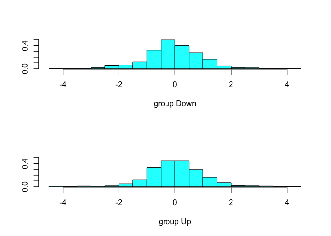

## 1. LDA on Smarket


```r
library(MASS)
library(ISLR)
data("Smarket")

train <- (Smarket$Year < 2005)

lda.fit <- lda(Direction~
                 Lag1 + Lag2,
               data = Smarket, subset = train)
lda.fit
```

```
## Call:
## lda(Direction ~ Lag1 + Lag2, data = Smarket, subset = train)
## 
## Prior probabilities of groups:
##     Down       Up 
## 0.491984 0.508016 
## 
## Group means:
##             Lag1        Lag2
## Down  0.04279022  0.03389409
## Up   -0.03954635 -0.03132544
## 
## Coefficients of linear discriminants:
##             LD1
## Lag1 -0.6420190
## Lag2 -0.5135293
```

```r
plot(lda.fit)
```

<!-- -->

```r
Smarket.2005 <- Smarket[!train,]
lda.pred <- predict(lda.fit, Smarket.2005)
lda.class <- lda.pred$class
table(lda.class, Smarket.2005$Direction)
```

```
##          
## lda.class Down  Up
##      Down   35  35
##      Up     76 106
```

```r
mean(lda.class == Smarket.2005$Direction)
```

```
## [1] 0.5595238
```

```r
sum(lda.pred$posterior[,1]>= 0.5)
```

```
## [1] 70
```

```r
sum(lda.pred$posterior[,1]< 0.5)
```

```
## [1] 182
```

```r
data.frame(posterior = lda.pred$posterior[1:20,1],
            pred_class = lda.pred$class[1:20], 
           row.names = NULL)
```

<div class="kable-table">

| posterior|pred_class |
|---------:|:----------|
| 0.4901792|Up         |
| 0.4792185|Up         |
| 0.4668185|Up         |
| 0.4740011|Up         |
| 0.4927877|Up         |
| 0.4938562|Up         |
| 0.4951016|Up         |
| 0.4872861|Up         |
| 0.4907013|Up         |
| 0.4844026|Up         |
| 0.4906963|Up         |
| 0.5119988|Down       |
| 0.4895152|Up         |
| 0.4706761|Up         |
| 0.4744593|Up         |
| 0.4799583|Up         |
| 0.4935775|Up         |
| 0.5030894|Down       |
| 0.4978806|Up         |
| 0.4886331|Up         |

</div>
## 2. QDA on Smarket data


```r
qda.fit <- qda(Direction ~
                 Lag1 + Lag2,
               data = Smarket, subset = train)
qda.fit
```

```
## Call:
## qda(Direction ~ Lag1 + Lag2, data = Smarket, subset = train)
## 
## Prior probabilities of groups:
##     Down       Up 
## 0.491984 0.508016 
## 
## Group means:
##             Lag1        Lag2
## Down  0.04279022  0.03389409
## Up   -0.03954635 -0.03132544
```

```r
qda.class <- predict(qda.fit,Smarket.2005)$class
table(qda.class, Smarket.2005$Direction)
```

```
##          
## qda.class Down  Up
##      Down   30  20
##      Up     81 121
```

```r
mean(qda.class == Smarket.2005$Direction)
```

```
## [1] 0.5992063
```

```r
cat("testing lda against qda")
```

```
## testing lda against qda
```

```r
table(lda.class,qda.class)
```

```
##          qda.class
## lda.class Down  Up
##      Down   50  20
##      Up      0 182
```

## 3. KNN on Smarket


```r
library(class)
train.X <- cbind(Smarket$Lag1, Smarket$Lag2)[train,]
test.X <- cbind(Smarket$Lag1, Smarket$Lag2)[!train,]
train.Direction <- Smarket$Direction[train]
set.seed(1)
knn.pred <- knn(train.X, test.X, train.Direction, k=1)
table(knn.pred, Smarket.2005$Direction)
```

```
##         
## knn.pred Down Up
##     Down   43 58
##     Up     68 83
```

```r
(83+43)/252
```

```
## [1] 0.5
```

```r
knn.pred <- knn(train.X, test.X, train.Direction, k=3)
table(knn.pred, Smarket.2005$Direction)
```

```
##         
## knn.pred Down Up
##     Down   48 54
##     Up     63 87
```

```r
mean(knn.pred == Smarket.2005$Direction)
```

```
## [1] 0.5357143
```

## 4. KNN to Caravan data


```r
rm(list = ls())
dim(Caravan)
```

```
## [1] 5822   86
```

```r
attach(Caravan)

summary(Purchase)
```

```
##   No  Yes 
## 5474  348
```

```r
348/5822
```

```
## [1] 0.05977327
```

```r
standardized.X <- scale(Caravan[,-86])
var(Caravan[,2])
```

```
## [1] 0.1647078
```

```r
var(standardized.X[,1])
```

```
## [1] 1
```

```r
var(standardized.X[,2])
```

```
## [1] 1
```

```r
test <- 1:1000
train.X <- standardized.X[-test,]
test.X <- standardized.X[test,]
train.Y <- Purchase[-test]
test.Y <- Purchase[test]
set.seed(1)
knn.pred <- knn(train.X, test.X, train.Y, k = 1)
mean(test.Y != knn.pred)
```

```
## [1] 0.118
```

```r
mean(test.Y!= "No")
```

```
## [1] 0.059
```

```r
table(knn.pred, test.Y)
```

```
##         test.Y
## knn.pred  No Yes
##      No  873  50
##      Yes  68   9
```

```r
9/(68+9)
```

```
## [1] 0.1168831
```

```r
knn.pred <- knn(train.X, test.X, train.Y, k = 3)
mean(test.Y != knn.pred)
```

```
## [1] 0.075
```

```r
table(knn.pred, test.Y)
```

```
##         test.Y
## knn.pred  No Yes
##      No  920  54
##      Yes  21   5
```

```r
5/26
```

```
## [1] 0.1923077
```

```r
knn.pred <- knn(train.X, test.X, train.Y, k = 5)
mean(test.Y != knn.pred)
```

```
## [1] 0.066
```

```r
table(knn.pred, test.Y)
```

```
##         test.Y
## knn.pred  No Yes
##      No  930  55
##      Yes  11   4
```

```r
4/15
```

```
## [1] 0.2666667
```

```r
detach("Caravan")
```

## 5. Logit on Caravan


```r
> glm.fits=glm(Purchase∼.,data=Caravan,family=binomial, subset=-test)
Warning message:
glm.fits: fitted probabilities numerically 0 or 1 occurred
> glm.probs=predict(glm.fits,Caravan[test,],type="response") > glm.pred=rep("No",1000)
> glm.pred[glm.probs>.5]="Yes"
> table(glm.pred,test.Y)

          test.Y 
glm.pred No   Yes 
      No 934  59 
      Yes 7   0
      
> glm.pred=rep("No",1000)
> glm.pred[glm.probs>.25]="Yes" > table(glm.pred,test.Y)
          test.Y 
glm.pred  No    Yes 
      No  919   48 
      Yes 22    11
      
> 11/(22+11) 
[1] 0.333
```

