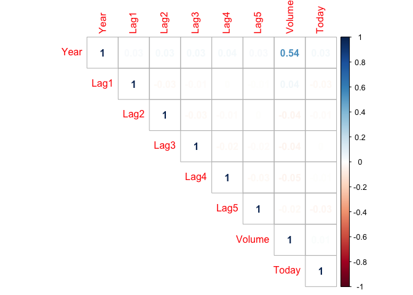
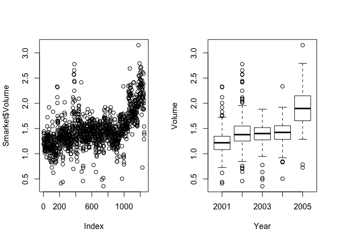

##  1. Load data
  
##  2. Correlations in data
  

```r
library(ISLR)
library(corrplot)
```

```
## corrplot 0.84 loaded
```

```r
data("Smarket")
names(Smarket)
```

```
## [1] "Year"      "Lag1"      "Lag2"      "Lag3"      "Lag4"      "Lag5"     
## [7] "Volume"    "Today"     "Direction"
```

```r
summary(Smarket)
```

```
##       Year           Lag1                Lag2                Lag3          
##  Min.   :2001   Min.   :-4.922000   Min.   :-4.922000   Min.   :-4.922000  
##  1st Qu.:2002   1st Qu.:-0.639500   1st Qu.:-0.639500   1st Qu.:-0.640000  
##  Median :2003   Median : 0.039000   Median : 0.039000   Median : 0.038500  
##  Mean   :2003   Mean   : 0.003834   Mean   : 0.003919   Mean   : 0.001716  
##  3rd Qu.:2004   3rd Qu.: 0.596750   3rd Qu.: 0.596750   3rd Qu.: 0.596750  
##  Max.   :2005   Max.   : 5.733000   Max.   : 5.733000   Max.   : 5.733000  
##       Lag4                Lag5              Volume           Today          
##  Min.   :-4.922000   Min.   :-4.92200   Min.   :0.3561   Min.   :-4.922000  
##  1st Qu.:-0.640000   1st Qu.:-0.64000   1st Qu.:1.2574   1st Qu.:-0.639500  
##  Median : 0.038500   Median : 0.03850   Median :1.4229   Median : 0.038500  
##  Mean   : 0.001636   Mean   : 0.00561   Mean   :1.4783   Mean   : 0.003138  
##  3rd Qu.: 0.596750   3rd Qu.: 0.59700   3rd Qu.:1.6417   3rd Qu.: 0.596750  
##  Max.   : 5.733000   Max.   : 5.73300   Max.   :3.1525   Max.   : 5.733000  
##  Direction 
##  Down:602  
##  Up  :648  
##            
##            
##            
## 
```

```r
cor(Smarket[,-9])
```

```
##              Year         Lag1         Lag2         Lag3         Lag4
## Year   1.00000000  0.029699649  0.030596422  0.033194581  0.035688718
## Lag1   0.02969965  1.000000000 -0.026294328 -0.010803402 -0.002985911
## Lag2   0.03059642 -0.026294328  1.000000000 -0.025896670 -0.010853533
## Lag3   0.03319458 -0.010803402 -0.025896670  1.000000000 -0.024051036
## Lag4   0.03568872 -0.002985911 -0.010853533 -0.024051036  1.000000000
## Lag5   0.02978799 -0.005674606 -0.003557949 -0.018808338 -0.027083641
## Volume 0.53900647  0.040909908 -0.043383215 -0.041823686 -0.048414246
## Today  0.03009523 -0.026155045 -0.010250033 -0.002447647 -0.006899527
##                Lag5      Volume        Today
## Year    0.029787995  0.53900647  0.030095229
## Lag1   -0.005674606  0.04090991 -0.026155045
## Lag2   -0.003557949 -0.04338321 -0.010250033
## Lag3   -0.018808338 -0.04182369 -0.002447647
## Lag4   -0.027083641 -0.04841425 -0.006899527
## Lag5    1.000000000 -0.02200231 -0.034860083
## Volume -0.022002315  1.00000000  0.014591823
## Today  -0.034860083  0.01459182  1.000000000
```

```r
corrplot(cor(Smarket[,-9]), method = "number", type = "upper")
```

<!-- -->

##  3. plot Volume
  

```r
par(mfrow = c(1,2))
plot(Smarket$Volume)
plot(Smarket$Volume~ as.factor(Smarket$Year), xlab = "Year", ylab = "Volume")
```

<!-- -->
  
##  4. Fit glm() with logistic regression 
### (Y = Direction, X = Lag[1-5], Volume)
  

```r
glm.fit = glm(Direction ~ 
                Lag1 + Lag2 +Lag3 +Lag4 +Lag5 +Volume,
              data = Smarket, 
              family = binomial)
summary(glm.fit)
```

```
## 
## Call:
## glm(formula = Direction ~ Lag1 + Lag2 + Lag3 + Lag4 + Lag5 + 
##     Volume, family = binomial, data = Smarket)
## 
## Deviance Residuals: 
##    Min      1Q  Median      3Q     Max  
## -1.446  -1.203   1.065   1.145   1.326  
## 
## Coefficients:
##              Estimate Std. Error z value Pr(>|z|)
## (Intercept) -0.126000   0.240736  -0.523    0.601
## Lag1        -0.073074   0.050167  -1.457    0.145
## Lag2        -0.042301   0.050086  -0.845    0.398
## Lag3         0.011085   0.049939   0.222    0.824
## Lag4         0.009359   0.049974   0.187    0.851
## Lag5         0.010313   0.049511   0.208    0.835
## Volume       0.135441   0.158360   0.855    0.392
## 
## (Dispersion parameter for binomial family taken to be 1)
## 
##     Null deviance: 1731.2  on 1249  degrees of freedom
## Residual deviance: 1727.6  on 1243  degrees of freedom
## AIC: 1741.6
## 
## Number of Fisher Scoring iterations: 3
```

```r
coef(glm.fit)
```

```
##  (Intercept)         Lag1         Lag2         Lag3         Lag4         Lag5 
## -0.126000257 -0.073073746 -0.042301344  0.011085108  0.009358938  0.010313068 
##       Volume 
##  0.135440659
```

```r
cat("following is p-values column")
```

```
## following is p-values column
```

```r
summary(glm.fit)$coef[,4]
```

```
## (Intercept)        Lag1        Lag2        Lag3        Lag4        Lag5 
##   0.6006983   0.1452272   0.3983491   0.8243333   0.8514445   0.8349974 
##      Volume 
##   0.3924004
```
  
##  5. Predict probabilities for Direction (1 = up, 2 = down)
###  Type = "response" [P(Y = 1|X)]
  
##  6. Make predictions for Up and down separately
  
##  7. Create confusion matrix 
### (correctly or incorrectly classified directions in predictions)


```r
contrasts(Smarket$Direction)
```

```
##      Up
## Down  0
## Up    1
```

```r
glm.prob = predict(glm.fit, type = "response")
glm.prob[1:10]
```

```
##         1         2         3         4         5         6         7         8 
## 0.5070841 0.4814679 0.4811388 0.5152224 0.5107812 0.5069565 0.4926509 0.5092292 
##         9        10 
## 0.5176135 0.4888378
```

```r
glm.pred <- rep("Down", length(glm.prob))
glm.pred[glm.prob > .5] <- "Up"
knitr::kable(table(glm.pred, Smarket$Direction), caption = "confusion matrix")
```


Table: confusion matrix

|     | Down|  Up|
|:----|----:|---:|
|Down |  145| 141|
|Up   |  457| 507|

```r
cat(paste0("correct predictions = ", (507+145)/1250))
```

```
## correct predictions = 0.5216
```

```r
mean(glm.pred == Smarket$Direction)
```

```
## [1] 0.5216
```

```r
cat(paste0("training error rate  = [100 - 52.2]% = ", 100-52.2, "%"))
```

```
## training error rate  = [100 - 52.2]% = 47.8%
```
  
##  8. Split data in training and test
  

```r
train = (Smarket$Year < 2005)
Smarket_2005 <- Smarket[!train,]
Direction_2005 <- Smarket$Direction[!train]
```
  
##  9. glm() fit using subset
  
##  10. Look at predictions on test
  

```r
glm.fit2 <- glm(Direction ~
                  Lag1 + Lag2 + Lag3 + Lag4 + Lag5 + Volume,
                data = Smarket, subset = train, 
                family = binomial)

glm.prob2 <- predict(glm.fit2, Smarket_2005, type = "response")
glm.pred2 <- rep("Down", length(glm.prob2))
glm.pred2[glm.prob2 > 0.5] <- "Up"
knitr::kable(table(glm.pred2, Direction_2005), caption = "prediction error")
```


Table: prediction error

|     | Down| Up|
|:----|----:|--:|
|Down |   77| 97|
|Up   |   34| 44|

```r
cat(paste0("the prediction accuracy on test = ", mean(glm.pred2 == Direction_2005)))
```

```
## the prediction accuracy on test = 0.48015873015873
```

```r
cat(paste0("the test error rate = ", mean(glm.pred2 != Direction_2005)))
```

```
## the test error rate = 0.51984126984127
```
  
##  11. Refit glm() with only `Lag1` and `Lag2`


```r
glm.fit3=glm(Direction~ 
             Lag1+Lag2,
             data=Smarket, subset=train, 
             family=binomial)
summary(glm.fit3)
```

```
## 
## Call:
## glm(formula = Direction ~ Lag1 + Lag2, family = binomial, data = Smarket, 
##     subset = train)
## 
## Deviance Residuals: 
##    Min      1Q  Median      3Q     Max  
## -1.345  -1.188   1.074   1.164   1.326  
## 
## Coefficients:
##             Estimate Std. Error z value Pr(>|z|)
## (Intercept)  0.03222    0.06338   0.508    0.611
## Lag1        -0.05562    0.05171  -1.076    0.282
## Lag2        -0.04449    0.05166  -0.861    0.389
## 
## (Dispersion parameter for binomial family taken to be 1)
## 
##     Null deviance: 1383.3  on 997  degrees of freedom
## Residual deviance: 1381.4  on 995  degrees of freedom
## AIC: 1387.4
## 
## Number of Fisher Scoring iterations: 3
```

```r
glm.prob3=predict(glm.fit3,Smarket_2005,type="response")
glm.pred3=rep("Down",252)
glm.pred3[glm.prob3>.5]="Up"
knitr::kable(table(glm.pred3,Direction_2005), caption = "prediction error")
```


Table: prediction error

|     | Down|  Up|
|:----|----:|---:|
|Down |   35|  35|
|Up   |   76| 106|

```r
cat(paste0("prediction accuracy on test = ", mean(glm.pred3==Direction_2005)))
```

```
## prediction accuracy on test = 0.55952380952381
```

```r
cat(paste0("true positives for Up = ", 106/(106+76)))
```

```
## true positives for Up = 0.582417582417582
```
  
##  12. Predict Direction 
### when `Lag1 = 1.2,1.5` and `Lag2 = 1.1,-0.8`
  

```r
data.frame(Lag1 = c(1.2,1.5), Lag2 = c(1.1,-0.8))
```

```
##   Lag1 Lag2
## 1  1.2  1.1
## 2  1.5 -0.8
```

```r
predict3 <- predict(glm.fit3,
        newdata = data.frame(Lag1 = c(1.2,1.5), Lag2 = c(1.1,-0.8)), 
        type = "response")
cbind(data.frame(Lag1 = c(1.2,1.5), Lag2 = c(1.1,-0.8)), pred = predict3)
```

```
##   Lag1 Lag2      pred
## 1  1.2  1.1 0.4791462
## 2  1.5 -0.8 0.4960939
```
  
  
