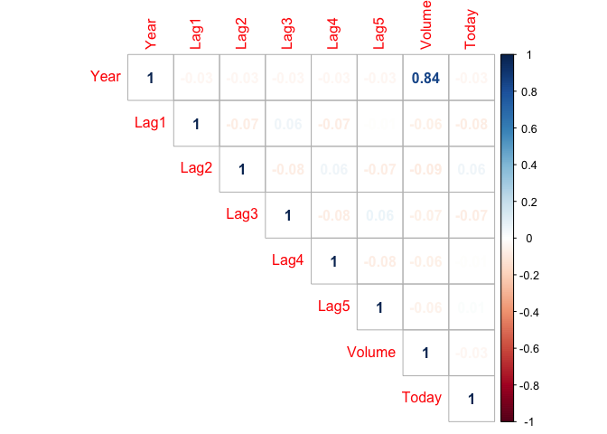
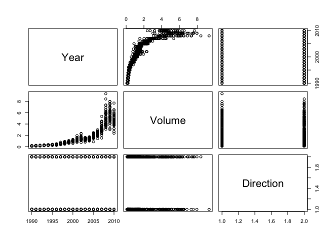
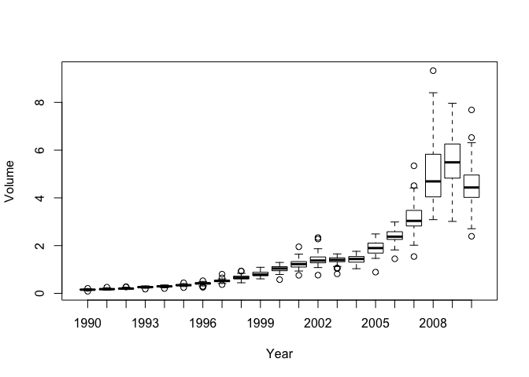
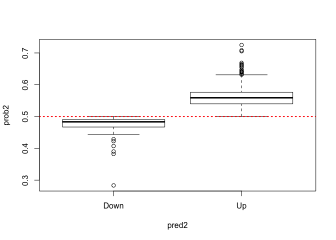

## Exercise (section 4.2, ISLR book)

### 1. load weekly data set and get descriptives

```r
library(ISLR)
library(corrplot)
```

```
## corrplot 0.84 loaded
```

```r
library(knitr)

data("Weekly")

Weekly[1:10,]
```

<div class="kable-table">

| Year|   Lag1|   Lag2|   Lag3|   Lag4|   Lag5|    Volume|  Today|Direction |
|----:|------:|------:|------:|------:|------:|---------:|------:|:---------|
| 1990|  0.816|  1.572| -3.936| -0.229| -3.484| 0.1549760| -0.270|Down      |
| 1990| -0.270|  0.816|  1.572| -3.936| -0.229| 0.1485740| -2.576|Down      |
| 1990| -2.576| -0.270|  0.816|  1.572| -3.936| 0.1598375|  3.514|Up        |
| 1990|  3.514| -2.576| -0.270|  0.816|  1.572| 0.1616300|  0.712|Up        |
| 1990|  0.712|  3.514| -2.576| -0.270|  0.816| 0.1537280|  1.178|Up        |
| 1990|  1.178|  0.712|  3.514| -2.576| -0.270| 0.1544440| -1.372|Down      |
| 1990| -1.372|  1.178|  0.712|  3.514| -2.576| 0.1517220|  0.807|Up        |
| 1990|  0.807| -1.372|  1.178|  0.712|  3.514| 0.1323100|  0.041|Up        |
| 1990|  0.041|  0.807| -1.372|  1.178|  0.712| 0.1439720|  1.253|Up        |
| 1990|  1.253|  0.041|  0.807| -1.372|  1.178| 0.1336350| -2.678|Down      |

</div>

```r
summary(Weekly)
```

```
##       Year           Lag1               Lag2               Lag3         
##  Min.   :1990   Min.   :-18.1950   Min.   :-18.1950   Min.   :-18.1950  
##  1st Qu.:1995   1st Qu.: -1.1540   1st Qu.: -1.1540   1st Qu.: -1.1580  
##  Median :2000   Median :  0.2410   Median :  0.2410   Median :  0.2410  
##  Mean   :2000   Mean   :  0.1506   Mean   :  0.1511   Mean   :  0.1472  
##  3rd Qu.:2005   3rd Qu.:  1.4050   3rd Qu.:  1.4090   3rd Qu.:  1.4090  
##  Max.   :2010   Max.   : 12.0260   Max.   : 12.0260   Max.   : 12.0260  
##       Lag4               Lag5              Volume            Today         
##  Min.   :-18.1950   Min.   :-18.1950   Min.   :0.08747   Min.   :-18.1950  
##  1st Qu.: -1.1580   1st Qu.: -1.1660   1st Qu.:0.33202   1st Qu.: -1.1540  
##  Median :  0.2380   Median :  0.2340   Median :1.00268   Median :  0.2410  
##  Mean   :  0.1458   Mean   :  0.1399   Mean   :1.57462   Mean   :  0.1499  
##  3rd Qu.:  1.4090   3rd Qu.:  1.4050   3rd Qu.:2.05373   3rd Qu.:  1.4050  
##  Max.   : 12.0260   Max.   : 12.0260   Max.   :9.32821   Max.   : 12.0260  
##  Direction 
##  Down:484  
##  Up  :605  
##            
##            
##            
## 
```

```r
corrplot(cor(Weekly[,1:8]), method = "number", type = "upper")
```

<!-- -->

```r
pairs(Weekly[,c("Year", "Volume", "Direction")])
```

<!-- -->

```r
plot(Weekly$Volume ~ as.factor(Weekly$Year), xlab = "Year", ylab = "Volume")
```

<!-- -->

### 2. glm() logistic regression


```r
fit1 <- glm(Direction~
              Lag1 + Lag2 + Lag3 + Lag4 + Lag5 + Volume, 
            data = Weekly,
            family = binomial)
summary(fit1)
```

```
## 
## Call:
## glm(formula = Direction ~ Lag1 + Lag2 + Lag3 + Lag4 + Lag5 + 
##     Volume, family = binomial, data = Weekly)
## 
## Deviance Residuals: 
##     Min       1Q   Median       3Q      Max  
## -1.6949  -1.2565   0.9913   1.0849   1.4579  
## 
## Coefficients:
##             Estimate Std. Error z value Pr(>|z|)   
## (Intercept)  0.26686    0.08593   3.106   0.0019 **
## Lag1        -0.04127    0.02641  -1.563   0.1181   
## Lag2         0.05844    0.02686   2.175   0.0296 * 
## Lag3        -0.01606    0.02666  -0.602   0.5469   
## Lag4        -0.02779    0.02646  -1.050   0.2937   
## Lag5        -0.01447    0.02638  -0.549   0.5833   
## Volume      -0.02274    0.03690  -0.616   0.5377   
## ---
## Signif. codes:  0 '***' 0.001 '**' 0.01 '*' 0.05 '.' 0.1 ' ' 1
## 
## (Dispersion parameter for binomial family taken to be 1)
## 
##     Null deviance: 1496.2  on 1088  degrees of freedom
## Residual deviance: 1486.4  on 1082  degrees of freedom
## AIC: 1500.4
## 
## Number of Fisher Scoring iterations: 4
```

```r
kable(summary(fit1)$coef)
```


|            |   Estimate| Std. Error|    z value| Pr(>&#124;z&#124;)|
|:-----------|----------:|----------:|----------:|------------------:|
|(Intercept) |  0.2668641|  0.0859296|  3.1056134|          0.0018988|
|Lag1        | -0.0412689|  0.0264103| -1.5626099|          0.1181444|
|Lag2        |  0.0584417|  0.0268650|  2.1753839|          0.0296014|
|Lag3        | -0.0160611|  0.0266630| -0.6023760|          0.5469239|
|Lag4        | -0.0277902|  0.0264633| -1.0501409|          0.2936533|
|Lag5        | -0.0144721|  0.0263848| -0.5485006|          0.5833482|
|Volume      | -0.0227415|  0.0368981| -0.6163330|          0.5376748|

```r
kable(summary(fit1)$coef[3,],col.names = "Lag2")
```


|                   |      Lag2|
|:------------------|---------:|
|Estimate           | 0.0584417|
|Std. Error         | 0.0268650|
|z value            | 2.1753839|
|Pr(>&#124;z&#124;) | 0.0296014|

### 3. Predictions and confusion matrix


```r
prob1 <- predict(fit1, type = "response")
pred <- rep("Down", length(prob1))
pred[prob1 > 0.5] <- "Up"
kable(table(pred, Weekly$Direction))
```


|     | Down|  Up|
|:----|----:|---:|
|Down |   54|  48|
|Up   |  430| 557|

```r
cat(paste0("prediction accuracy = ", (54+557)/1089))
```

```
## prediction accuracy = 0.561065197428834
```

### 4. Fit glm() using `Lag2` only


```r
fit2 <- glm(Direction~
              Lag2, 
            data = Weekly,
            family = binomial)
summary(fit2)
```

```
## 
## Call:
## glm(formula = Direction ~ Lag2, family = binomial, data = Weekly)
## 
## Deviance Residuals: 
##    Min      1Q  Median      3Q     Max  
## -1.564  -1.267   1.008   1.086   1.386  
## 
## Coefficients:
##             Estimate Std. Error z value Pr(>|z|)    
## (Intercept)  0.21473    0.06123   3.507 0.000453 ***
## Lag2         0.06279    0.02636   2.382 0.017230 *  
## ---
## Signif. codes:  0 '***' 0.001 '**' 0.01 '*' 0.05 '.' 0.1 ' ' 1
## 
## (Dispersion parameter for binomial family taken to be 1)
## 
##     Null deviance: 1496.2  on 1088  degrees of freedom
## Residual deviance: 1490.4  on 1087  degrees of freedom
## AIC: 1494.4
## 
## Number of Fisher Scoring iterations: 4
```

```r
kable(summary(fit2)$coef)
```


|            |  Estimate| Std. Error|  z value| Pr(>&#124;z&#124;)|
|:-----------|---------:|----------:|--------:|------------------:|
|(Intercept) | 0.2147315|  0.0612262| 3.507185|          0.0004529|
|Lag2        | 0.0627906|  0.0263630| 2.381772|          0.0172295|

```r
kable(data.frame(fit1 = summary(fit1)$coef[3,4], fit2 = summary(fit2)$coef[2,4], row.names = "p-values"),
      caption = "change in probabilities of Lag2", digits = 4)
```


Table: change in probabilities of Lag2

|         |   fit1|   fit2|
|:--------|------:|------:|
|p-values | 0.0296| 0.0172|

### 5. Predictions and confusion matrix for `fit2`


```r
prob2 <- predict(fit2, type = "response")
pred2 <- rep("Down", length(prob2))
pred2[prob2 > 0.5] <- "Up"
kable(table(pred2, Weekly$Direction))
```


|     | Down|  Up|
|:----|----:|---:|
|Down |   33|  26|
|Up   |  451| 579|

```r
cat(paste0("prediction accuracy = ", mean(pred2 == Weekly$Direction)))
```

```
## prediction accuracy = 0.56198347107438
```

```r
boxplot(prob2~pred2)
abline(h=0.5,col = "red", lwd = 2, lty = 3)
```

<!-- -->
